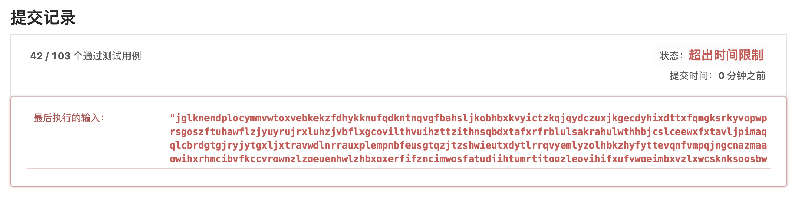

# 5 最长回文子串

- 爆破

  首先想到的思路就是爆破，虽然知道肯定不能AC但是还是想先试试。结果是通过了42/103个测试样例。

  

  代码也贴一下

  ```cpp
  string longestPalindrome(string s) {
      int slen = s.length();
      int maxLen = 0;
      string resStr;
      string s2, s2rev;
      for(int i=0;i<slen;i++)
      {
          for(int j=i;j<slen;j++)
          {
              if(j-i+1<=maxLen) continue;
              s2 = s.substr(i, j-i+1);
              s2rev.assign(s2.rbegin(),s2.rend());
              // judge s2 and s2.reverse
              if(s2.compare(s2rev) == 0) {
                  resStr = s2;
                  maxLen = resStr.length();
              };
          }
      }
      return resStr;
  }
  ```

  

- 小插曲 😭

  中间思路出现了偏差，收到爆破思路的启发，觉得只需要找到原字符串和反转字符串的最长公共子串即可（采用类似LCS的动态规划），甚至大部分样例都通过了。小插曲的代码贴下：

  ```cpp
  string longestPalindrome(string s) {
      int slen = s.length();
      string resStr;
      int maxLen = 0;
      string sRev;
      sRev.assign(s.rbegin(),s.rend());
      int map[slen+1][slen+1];
      memset(map, 0, sizeof(map));
      for(int i=1;i<=slen;i++)
          for(int j=1;j<=slen;j++)
          {
              if(s[i-1] == sRev[j-1]){
                  map[i][j] = map[i-1][j-1]+1;
                  if(map[i][j]>maxLen) 
                  {
                      maxLen = map[i][j];
                      resStr.assign(s.begin()+i-maxLen,s.begin()+i);
                  }
              }
              else map[i][j]=0;
          }
      return resStr;
  }
  ```

- 小插曲plus 😊

  小插曲加上验证居然就OK了，想来是最长回文子串肯定在上面产生出来的子串之中，但不一定是上面最长的一个。懂！

  ```cpp
  bool testStr(string s)
  {
      string sRev;
      sRev.assign(s.rbegin(),s.rend());
      if(s.compare(sRev) == 0) return true;
      return false;
  }
  string longestPalindrome(string s) {
      int slen = s.length();
      string resStr;
      int maxLen = 0;
      string sRev;
      sRev.assign(s.rbegin(),s.rend());
      int map[slen+1][slen+1];
      memset(map, 0, sizeof(map));
      for(int i=1;i<=slen;i++)
          for(int j=1;j<=slen;j++)
          {
              if(s[i-1] == sRev[j-1]){
                  map[i][j] = map[i-1][j-1]+1;
                  if(map[i][j]>maxLen) 
                  {
                      if(testStr(s.substr(i-map[i][j],map[i][j])))
                      {
                      maxLen = map[i][j];
                      resStr=s.substr(i-maxLen,maxLen);
                      }
                  }
              }
              else map[i][j]=0;
          }
      return resStr;
  }
  ```

  